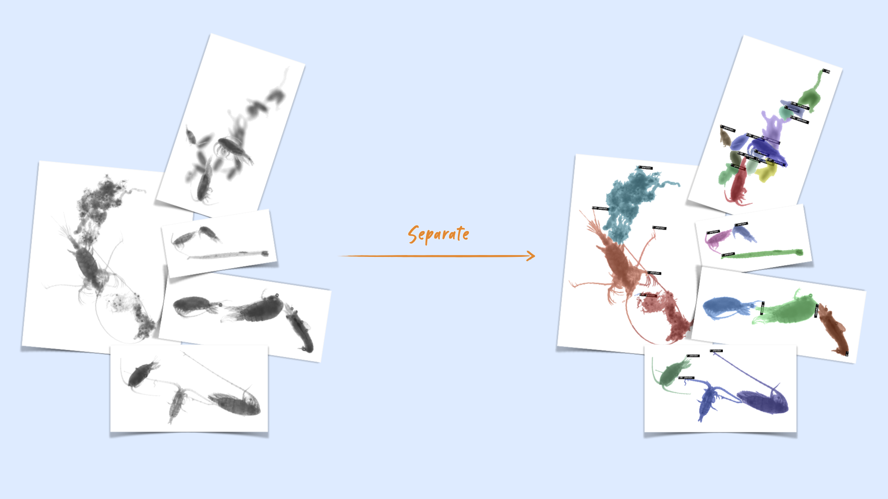

# zooprocess-multiple-separator
[](https://jenkins.services.ai4os.eu/job/AI4OS-hub/job/zooprocess-multiple-separator/job/main/)

This module processes images produced by ZooProcess that may contain multiple objects and separates the objects by drawing lines between them. This allows the rest of the processing to work on individual objects, which is necessary for their classification and measurements.

 The segmentation is based on Mask2Former, in panoptic mode, but the resulting detections are further processed to match the original objects to the pixel and draw the separation lines.

To launch it, first install the package then run [deepaas](https://github.com/ai4os/DEEPaaS):
```bash
git clone https://github.com/ai4os-hub/zooprocess-multiple-separator/zooprocess-multiple-separator
cd zooprocess-multiple-separator
pip install -e .
deepaas-run --listen-ip 0.0.0.0
```

## Docker images

Once a version is pushed to the main branch, it should be built automatically through [AI4OS Jenkins service](https://jenkins.services.ai4os.eu/job/AI4OS-hub/job/zooprocess-multiple-separator/) and become available from [dockerhub](https://hub.docker.com/r/ai4oshub/zooprocess-multiple-separator/tags).

Getting the image works through
```bash
docker pull ai4oshub/zooprocess-multiple-separator:latest
```



## Project structure
```
│
├── Dockerfile             <- Describes main steps on integration of DEEPaaS API and
│                             zooprocess_multiple_separator application in one Docker image
│
├── Jenkinsfile            <- Describes basic Jenkins CI/CD pipeline (see .sqa/)
│
├── LICENSE                <- License file
│
├── README.md              <- The top-level README for developers using this project.
│
├── VERSION                <- zooprocess_multiple_separator version file
│
├── .sqa/                  <- CI/CD configuration files
│
├── zooprocess_multiple_separator    <- Source code for use in this project.
│   │
│   ├── __init__.py        <- Makes zooprocess_multiple_separator a Python module
│   │
│   ├── api.py             <- Main script for the integration with DEEPaaS API
│   |
│   ├── config.py          <- Configuration file to define Constants used across zooprocess_multiple_separator
│   │
│   └── misc.py            <- Misc functions that were helpful accross projects
│   │
│   └── utils.py           <- Contains the actual code to perform inference
│
├── data/                  <- Folder to store the data
│
├── models/                <- Folder to store models
│   
├── tests/                 <- Scripts to perfrom code testing
|
├── metadata.json          <- Metadata information propagated to the AI4OS Hub
│
├── pyproject.toml         <- a configuration file used by packaging tools, so zooprocess_multiple_separator
│                             can be imported or installed with  `pip install -e .`                             
│
├── requirements.txt       <- The requirements file for reproducing the analysis environment, i.e.
│                             contains a list of packages needed to make zooprocess_multiple_separator work
│
├── requirements-test.txt  <- The requirements file for running code tests (see tests/ directory)
│
└── tox.ini                <- Configuration file for the tox tool used for testing (see .sqa/)
```
